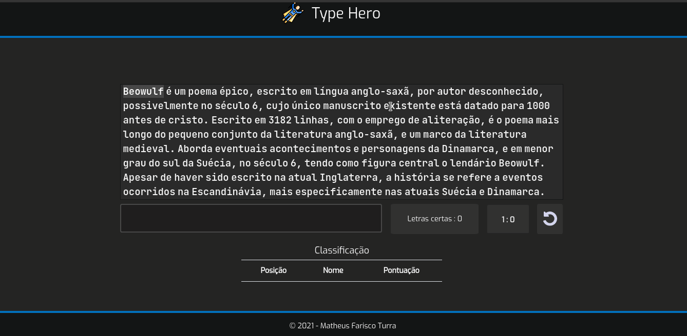

<div align="center">
    <h1>
        
        <strong>Type Hero</strong>
    </h1>
    <sub>:construction: Em desenvolvimento :construction:</sub>
</div>

<br/>
<br/>


<h5 align="center">Imagem acelerada</h5>
<h6 align="center">* Estado atual do projeto</h6>
</br>
</br>

## Sobre o projeto 📝
O projeto **Type Hero** tem o intuito de testar a sua velocidade de digitação em uma certa quantidade de tempo. O teste consiste na exibição de um texto real e 1 minuto para conclui-lo, terminado o tempo o teste se encerra e será mostrado o seu resultado, onde também é possível salva-lo em uma tabela de classificação, o resultado representa a quantidade de palavras digitadas por minuto (WPM em inglês).

</br>


## Funcionalidades ⚙️

* Prontas ⚡
  * Criar recorde no banco de dados.
  * Exibir texto.
  * Avaliação de texto em tempo real.
  * Avaliação de texto após o fim da palavra.
  * Cronômetro.
  * Botão para reiniciar jogo.  

<br>

* Em desenvolvimento 👷‍♂️
  * Interface de escolha de texto.
  * Interface de introdução ao projeto.  

<br>

## Tecnologias Utilizadas :rocket:	
* [Node JS](https://nodejs.org/en/)
* [Sequelize](https://sequelize.org/master/)
* [SQLite](https://www.sqlite.org/index.html)
* [Angular](https://angular.io/)

<br>

## Como testar o projeto :electric_plug:

### Pré requisitos
* [Node JS](https://nodejs.org/en/)
* [Git](https://git-scm.com/downloads)

<br>

### Instalação
```bash
  # Clona o repositório
  git clone https://github.com/MatheusTurra/TypeHero.git

  # Entra no diretório
  cd TypeHero

  # Instala dependências
  npm install

  # Executa migrations do banco de dados
  npm run migrate

  # Executa a aplicação
  npm run start
  
  # Acesse http://localhost:4200/ no Google Chrome
```
<hr/>
<h4 align="center">Desenvolvido por :hurtrealbad: Matheus Farisco Turra</h4>
